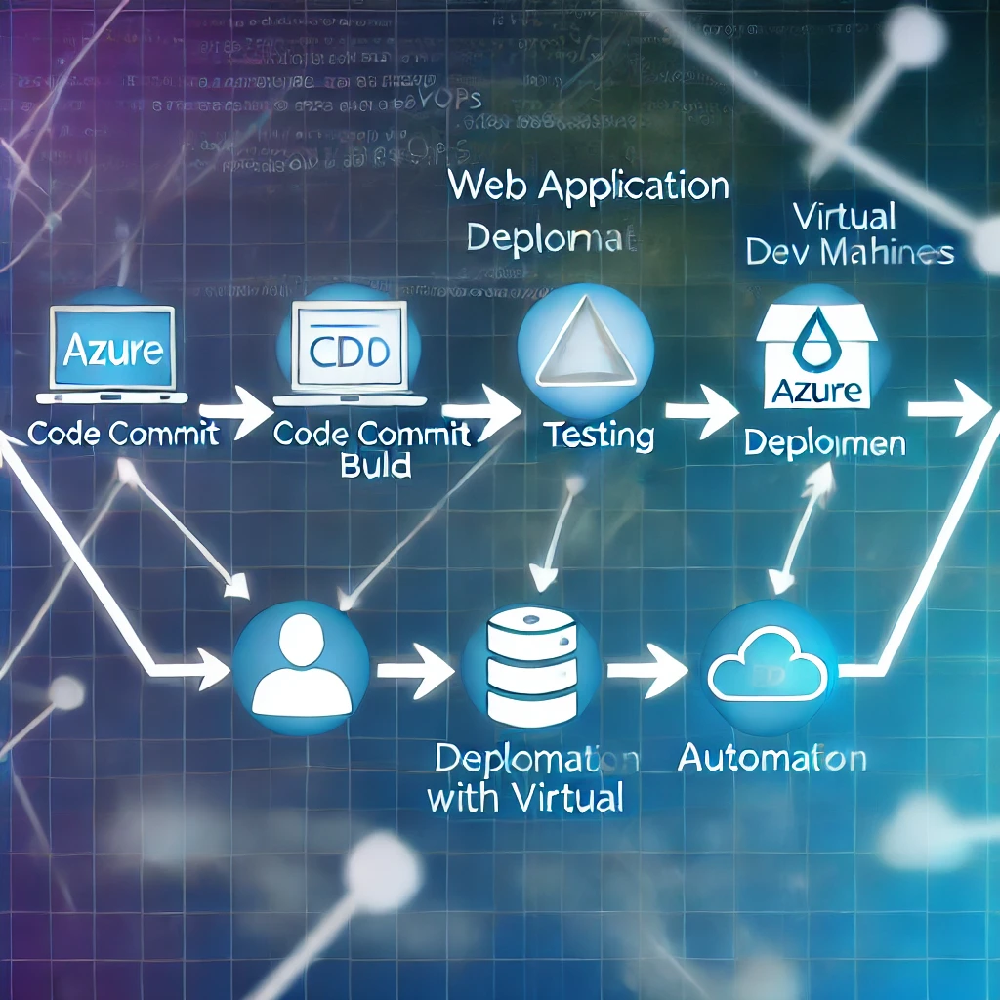

# Web Application Deployment Automation - CI/CD

This project demonstrates a complete CI/CD workflow for deploying a web application using Flask, Docker, and Azure DevOps.

## Overview

This automation pipeline facilitates continuous integration and continuous deployment (CI/CD) for a web application hosted on Azure. It uses Azure DevOps for version control, build, test, and deployment processes, ensuring efficient and streamlined releases.

## Features

- **Automated Deployment**: Leverages Docker and Azure DevOps Pipelines to automate the deployment process.
- **Versioning**: Uses unique build tags for each deployment to manage version control effectively.
- **Logging and Monitoring**: Integration with Azure for logging and monitoring of application performance.
